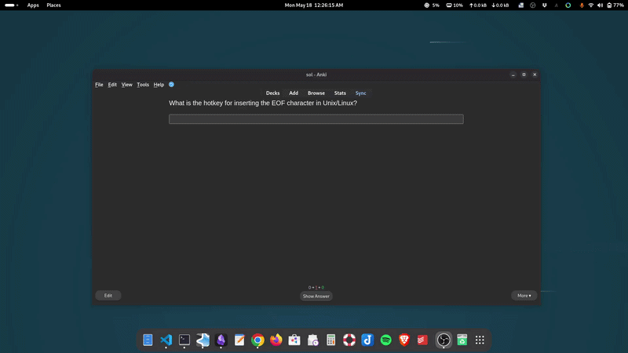

# Hotkey Capture

This works with any Anki note type that has the **Type In The Answer** feature, including both **Basic** and **Cloze**.

**The problem:** When studying hotkeys and keyboard shortcuts using a type-in-the answer card, you have to type the combination manually as a string (e.g. "Ctrl+D"). This is tedious and you don't get to practice they hotkeys.

**The fix:** When `Hotkey` is set to `true`, the script intercepts key combinations pressed while the type-in input is focused and inserts a consistently formatted string automatically. You press the actual hotkey, the script does the rest.



## Design Decisions

**Consistent modifier order:** Modifiers are always formatted in a fixed order: `Ctrl+Alt+Shift+Meta`, regardless of the physical order you press them. Pressing `Alt` before `Ctrl` still produces `Ctrl+Alt+...`. This ensures the captured string always matches the expected answer, no matter how the user physically pressed the combination.

**Uppercase keys:** The non-modifier key is always uppercased (`Ctrl+D`, not `Ctrl+d`). This matches the most widely used convention for documenting keyboard shortcuts. Make sure your answer in the **Back** field follows the same casing, otherwise Anki's diff will flag it as incorrect.

**Overwrite, not append:** If there is any existing text in the input when a hotkey is pressed, it is replaced entirely. The intended use is cards that test a single hotkey, so appending was not needed. If your use case requires appending, open an issue and it can be added.

**Front only:** Hotkey capture only applies to the front template.

## Requirements

- **Note type:** Any type-in-the-answer note type (Basic, Cloze, etc.)
- **Template:** Front only
- **Custom field:** `Hotkey`

## Setup

### 1. Add the `Hotkey` field

In Anki, open **Tools > Manage Note Types**, select your note type, and click **Fields**. Add a field named `Hotkey`.

### 2. Add the script to the front template

Open **Cards** for your note type and paste the script at the bottom of the **Front Template** only, wrapped in `<script> ... </script>` tags.

### 3. Enable it on your notes

Set the `Hotkey` field value depending on your platform:

| Value | Effect |
|---|---|
| `true` | Enables for all clozes with standard labels (`Ctrl`, `Alt`, `Shift`, `Meta`) |
| `true, mac` | Enables for all clozes with Mac labels (`Ctrl`, `Opt`, `Shift`, `Cmd`) |
| `1` | Enables only for cloze 1, standard labels |
| `1, mac` | Enables only for cloze 1, Mac labels |
| `1, 2` | Enables for clozes 1 and 2 |
| *(empty)* | Disabled, input behaves normally |

Tokens are order-independent. When both ordinals and `true` are present, ordinals take precedence.

## Platform Support

### Windows and Linux

Modifiers are captured and formatted as:

| Key pressed | Captured as |
|---|---|
| `Ctrl` | `Ctrl` |
| `Alt` | `Alt` |
| `Shift` | `Shift` |
| `Windows/Super` | `Meta` |

### macOS (`true, mac`)

Mac modifier keys map to the script's output as follows:

| Mac key | Captured as |
|---|---|
| `Control` | `Ctrl` |
| `Option (⌥)` | `Opt` |
| `Shift` | `Shift` |
| `Command (⌘)` | `Cmd` |

**Tip:** Make sure your Back field answer uses the same labels the script inserts. If a source says `Command+Option+T`, write it as `Cmd+Opt+T` in the Back field. Anki's diff is exact, so any label mismatch will be flagged as incorrect.

**Note:** Hotkey cards are inherently platform-specific. A `Ctrl+D` card targets Linux/Windows, a `Cmd+D` card targets Mac. Use `true, mac` only on cards written specifically for macOS, so the platform intent is clear when sharing with others.

## Behaviour

- Only key **combinations** are captured (at least one modifier key must be held).
- Pressing a modifier key alone (`Ctrl`, `Alt`, `Shift`, `Meta`) does nothing.
- `Ctrl+Enter` is excluded, as that is Anki's submit hotkey.
- Regular keypresses with no modifier pass through normally, so the input can still be used for typing if needed.

**Examples:**

| Keys pressed | `true` | `true, mac` |
|---|---|---|
| `Ctrl` + `D` | `Ctrl+D` | `Ctrl+D` |
| `Alt/Option` + `F` | `Alt+F` | `Opt+F` |
| `Cmd/Meta` + `S` | `Meta+S` | `Cmd+S` |
| `Ctrl` + `Alt` + `T` | `Ctrl+Alt+T` | `Ctrl+Opt+T` |
| `Shift` first, then `Ctrl+D` | `Ctrl+Shift+D` | `Ctrl+Shift+D` |

## Script

Paste this into the **Front Template** only, at the bottom wrapped in `<script> ... </script>` tags.

```javascript
(function () {
    function parseHotkeyField(fieldValue) {
        const parts = fieldValue.split(",").map(s => s.trim().toLowerCase());
        const ordinals = parts.filter(p => /^\d+$/.test(p)).map(Number);
        return {
            enabled: parts.includes("true") || ordinals.length > 0,
            mac: parts.includes("mac"),
            ordinals: ordinals.length > 0 ? new Set(ordinals) : null
        };
    }

    function getActiveOrdinal() {
        const active = document.querySelector(".cloze[data-ordinal]");
        return active ? Number(active.getAttribute("data-ordinal")) : null;
    }

    function formatHotkey(event, mac) {
        const modifiers = [];

        if (event.ctrlKey)  modifiers.push("Ctrl");
        if (event.altKey)   modifiers.push(mac ? "Opt" : "Alt");
        if (event.shiftKey) modifiers.push("Shift");
        if (event.metaKey)  modifiers.push(mac ? "Cmd" : "Meta");

        // Ignore modifier-only keypresses
        if (["Control", "Alt", "Shift", "Meta"].includes(event.key)) return null;

        // Exclude Ctrl+Enter (Anki submit)
        if (event.ctrlKey && event.key === "Enter") return null;

        // At least one modifier must be held
        if (modifiers.length === 0) return null;

        const key = event.key.toUpperCase();
        return [...modifiers, key].join("+");
    }

    function applyHotkeyCapture() {
        const input = document.getElementById("typeans");
        if (!input || input.tagName !== "INPUT") return;

        const { enabled, mac, ordinals } = parseHotkeyField("{{Hotkey}}");
        if (!enabled) return;

        if (ordinals !== null) {
            const activeOrdinal = getActiveOrdinal();
            if (activeOrdinal === null || !ordinals.has(activeOrdinal)) return;
        }

        input.addEventListener("keydown", function (event) {
            const hotkey = formatHotkey(event, mac);
            if (hotkey === null) return;

            event.preventDefault();
            input.value = hotkey;
        });
    }

    applyHotkeyCapture();
})();
```

## Notes

- `event.preventDefault()` prevents the browser from acting on the combination. For example, without it, pressing `Ctrl+D` in some browsers would trigger a bookmark action instead of being captured.
- The check `input.tagName !== "INPUT"` is what makes the script front-only safe. On the back, Anki replaces the input with a non-input element carrying the same `#typeans` ID, and the script exits early when it detects that.
- `event.key` returns the key name as defined by the browser. For letter keys this is always a single character, which `.toUpperCase()` handles cleanly.
