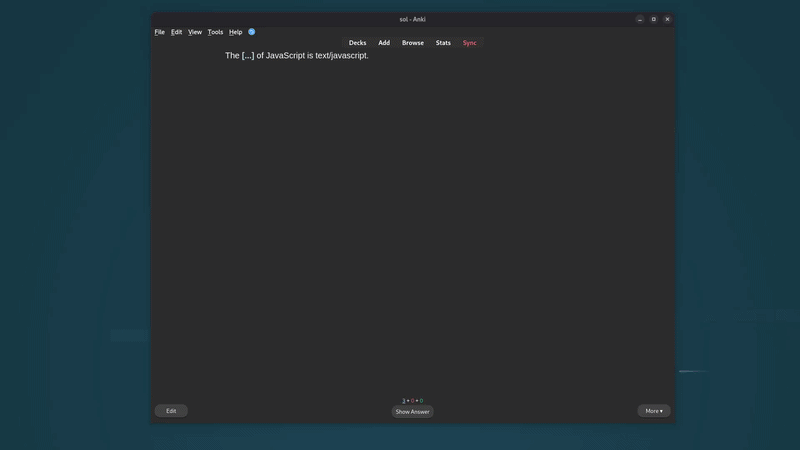

# Selective Cloze Input

This applies to **Cloze Deletion** cards with the **Type In The Answer** feature. If you don't have that note type set up yet, watch [this video](https://youtu.be/5tYObQ3ocrw) (skip to 3:22). It's best to create a new note type based on the standard Cloze rather than modifying it directly, so you keep both. Here's [how to create a new note type](https://youtu.be/4wODYPaayeM).

**The problem:** With type-in-the-answer cloze cards, Anki shows an input for every cloze. You can ignore the ones you don't want to type, but seeing them clutters the card, especially when you have a lot of them.

**The fix:** This script reads a `Show Input` field and only shows the input for the cloze ordinals listed there. All other clozes render normally, without the input. If `Show Input` is empty, the script does nothing and Anki behaves as usual.



## Setup

### 1. Create the note type

Create a new note type based on the standard Cloze (see links above). Add a field named `Show Input` to it.

### 2. Add the script to both templates

Open **Cards** for your note type and paste the script at the bottom of both the **Front Template** and **Back Template**, wrapped in `<script> ... </script>` tags.

### 3. Fill in the field

In the `Show Input` field on your notes, enter a comma-delimited list of cloze ordinals to show the input for.

| Value | Effect |
|---|---|
| `2` | Shows input only when cloze 2 is active |
| `1, 3` | Shows input when cloze 1 or cloze 3 is active |
| *(empty)* | Shows input for all clozes (default Anki behaviour) |

## Script

```javascript
(function () {
    function parseShowInput(fieldValue) {
        const ordinals = fieldValue
            .split(",")
            .map(s => s.trim())
            .filter(Boolean)
            .map(Number)
            .filter(n => !isNaN(n));
        return ordinals.length > 0 ? new Set(ordinals) : null;
    }

    function getActiveOrdinal() {
        const active = document.querySelector(".cloze[data-ordinal]");
        return active ? Number(active.getAttribute("data-ordinal")) : null;
    }

    function applyInputVisibility() {
        const typeans = document.getElementById("typeans");
        if (!typeans) return;

        const allowedOrdinals = parseShowInput("{{Show Input}}");
        if (allowedOrdinals === null) return;

        const activeOrdinal = getActiveOrdinal();
        typeans.style.display = (activeOrdinal !== null && allowedOrdinals.has(activeOrdinal))
            ? ""
            : "none";
    }

    applyInputVisibility();
})();
```

## Notes

- On the front, `#typeans` is the text input. On the back, it is a non-input element showing the comparison between your typed answer and the correct one. The same script handles both.
- The `{{Show Input}}` placeholder is substituted by Anki at render time, so no extra HTML is needed to read the field value.
- If a card has multiple active clozes visible at once, the script reads the ordinal of the first one in DOM order.